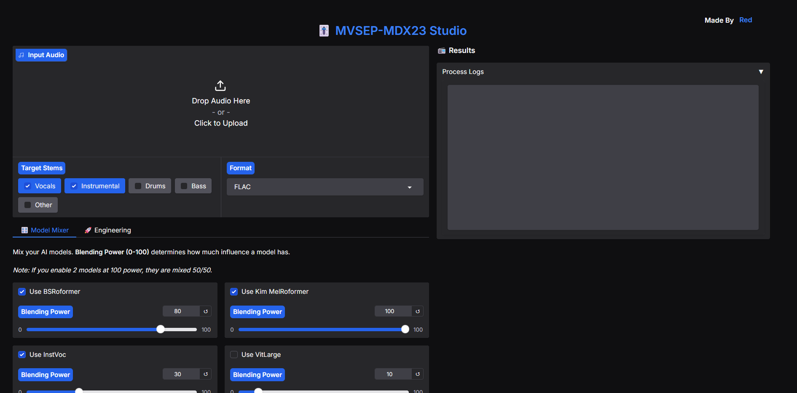

# 🎚️ MVSEP-MDX23 Studio (WebUI Edition)

A modernized, local WebUI for state-of-the-art music source separation. 

This is a fork of(https://github.com/jarredou/MVSEP-MDX23-Colab_v2), upgraded with a **Gradio Web Interface** and modern **`uv` dependency management**. It uses powerful Ensemble Neural Networks to split audio into Vocals, Instrumentals, Drums, Bass, and Other.

## ✨ New Features in this Version
* **Professional WebUI:** A clean, intuitive interface powered by Gradio.
* **The "Model Mixer":** Seamlessly blend the power of multiple AI models using 0-100% sliders.
* **Advanced Engineering Controls:** Easily tweak BigShifts, overlap buffers, gain staging, and low-end vocal filtering directly from the UI.
* **Smart Stem Logic:** Automatically optimizes processing speed if you only request Vocal and Instrumental stems.
* **Modern Dependency Management:** Powered by `uv` for lightning-fast, reproducible, and locked installations (no more broken environments).

---


## 🖼️ WebUI Preview

<p align="center">
  
</p>


## 📌 TODO

- [ ] 🐳 Docker support (containerized deployment)

## 🚀 Installation & Launch

This project uses(https://docs.astral.sh/uv/) for robust dependency management.

### 1. Install `uv` (if you haven't already)
**Windows:**
```powershell
powershell -ExecutionPolicy ByPass -c "irm https://astral.sh/uv/install.ps1 | iex"
```
**MacOS / Linux:**
```Bash
curl -LsSf https://astral.sh/uv/install.sh | sh 
```
### 2. Clone and Setup

```Bash
git clone https://github.com/RedsAnalysis/MVSEP-MDX23-Colab_v2.git
cd MVSEP-MDX23-Colab_v2
```
# This will automatically download the correct Python version and install all locked dependencies
```Bash
uv sync
```

### 3. Launch the WebUI
```Bash
uv run WebUI.py
```
Open your browser and navigate to http://localhost:7860.
(Note: The first time you run an extraction, the backend will automatically download the required model checkpoint files into the models/ folder. This may take a few minutes depending on your internet connection).


## 🧠 The Models Explained

This engine ensembles (combines) multiple models to achieve the highest possible Signal-to-Distortion Ratio (SDR). Here is what each model does:
* **🔪 BSRoformer (Band-Split Roformer):** The Surgical Scalpel. The current king of clarity. It aggressively separates vocals from complex tracks, making it perfect for crisp Pop, Rap, or spoken dialogue.

* **🧣 Kim MelRoformer:** The Warm Blanket. Processes audio closer to how the human ear hears. It preserves the "breath," emotion, and warmth of a vocal track. Excellent for acoustics and ballads.

* **🎤 InstVoc (MDX23C):** The Karaoke Machine. Aggressively removes vocals from the instrumental floor. Best used when your main goal is a perfect backing track.

* **🏋️ VitLarge:** The Heavy Lifter. Treats audio like an image using Vision Transformers. Highly effective on dense, chaotic mixes like Heavy Metal or Rock.

* **Demucs / MDX Legacy:** Fallback models automatically used when generating 4-stem outputs (Drums, Bass, Other).

## 🎛️ Recommended "Recipes" (Settings)

Depending on your source audio, adjust the Blending Power and Engineering Tab settings in the WebUI:

### Use Case	Model Mix (Power)	Advanced Settings
- **Studio Pop / Rap** :	BSRoformer (100) + MelRoformer (80)	BigShifts: 3
- **Acoustic / Singer-Songwriter**	: MelRoformer (100) + BSRoformer (60)	Filter Vocals: OFF
- **Anime / Cinematic Dialogue** : BSRoformer (100) + MelRoformer (50)	BigShifts: 7, Filter Vocals: ON (<50Hz)
- **Karaoke / Backing Track** :	InstVoc (100) + InstHQ4 (100)	Select "Instrumental" Output Only

## 📜 Credits & Lineage
This project stands on the shoulders of giants. Massive thanks to the original researchers, model trainers, and developers:
Original Algorithm & Colab Adaptation:(https://github.com/jarredou/MVSEP-MDX23-Colab_v2/)
Core MVSep Architecture:(https://github.com/ZFTurbo/MVSEP-MDX23-music-separation-model)
Model Training & Architectures by:
*(https://github.com/facebookresearch/demucs)
*(https://github.com/Anjok07/ultimatevocalremovergui)
*(https://github.com/KimberleyJensen) (MelRoformer)
*(https://github.com/aufr33) & viperx (BSRoformer)

